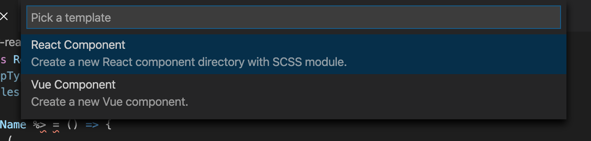
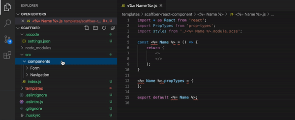

# Scaffixer

Scaffixer enables a context shortcut for scaffolding out entire files and directory trees for when snippets just aren't enough. Setup your own boilerplate template, custom input prompts, and Scaffixer will output the files right where you need them.



## Features

### EJS Templating

Use EJS tags for simple replacements. Works with file names, directory names, and file contents.

```
// <%= Name %>.js
import * as React from 'react';

const <%= Name %> = (props) => {
	return (
		<>
		</>
	)
};

export default <%= Name %>;
```



### Custom Prompts

Set the input prompts you'll need to replace 

## Extension Settings

This extension contributes the following settings:

- `scaffixer.templates`: an array of objects describing your templates.

example:
```json
{
	"name": "React Component",
	"description": "Create a new React component directory with SCSS module.",
	"location": "/Users/steve/templates/scaffixer-react-component",
	"prompts": ["Name"]
}
```

